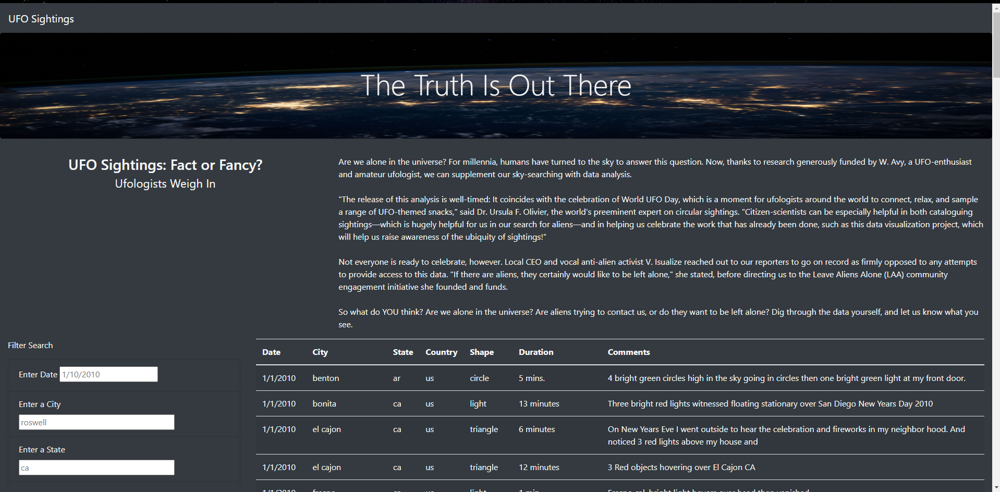
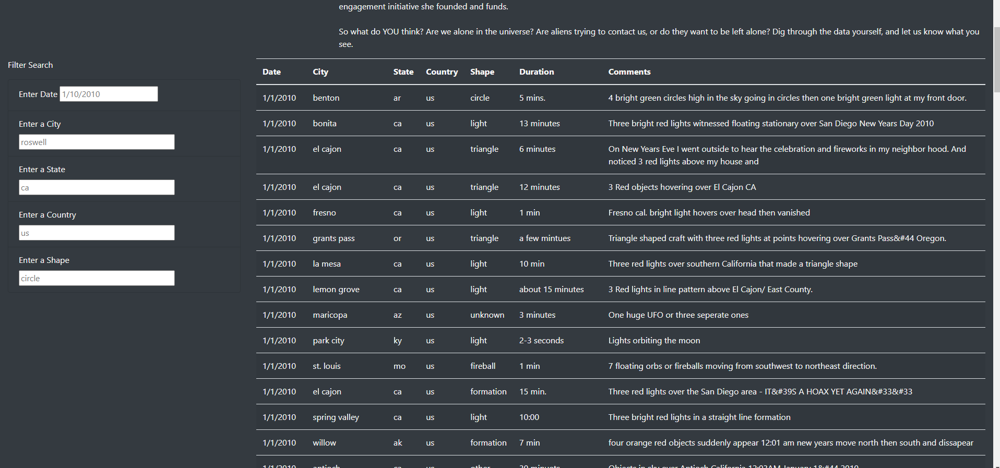
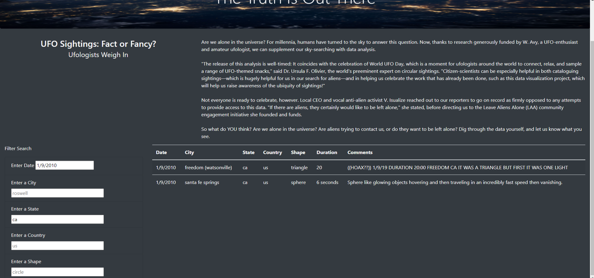

# UFO Finder

## Overview
Using JavaScript, HTML, and CSS to build a neat, user-friendly webpage featuring an article and a filterable data table.
  

  

## Results
_**Filtering Data**_
 
* The page's greatest tool is it's ability to quickly filter UFO sighting data. The user can search for sightings matching any date, city, state, country, and/or UFO shape, and will see results instantly.

 

* For example, if the user wants to find all sightings in California on January 9th, 2010, they can input their search parameters ('1/9/2010' and 'ca'), press 'Enter', and see results:

* There are two results, and the city, country, shape, duration, and comments are displayed as well.
  

## Summary
The page is generally successful, it accomplishes its goal of allowing the user to sort through a large set of neatly-presented data, but there is room for improvement.

A major weakness is the lack of additional resources. The page only includes basic facts about unverified sightings, it would be beneficial to include links to other pages that support these sightings and/or provide more information. Another way to improve the page's utility could be the addition of a social media feed that collects alien-related content (posts, pictures, videos) from across the internet, or to feature new pages about specific sightings (i.e., "Sightings On This Day in History").

It is a great start for a webpage, but it is just that, a start. Luckily with JavaScript, HTML, and other web tools, anything is possible.